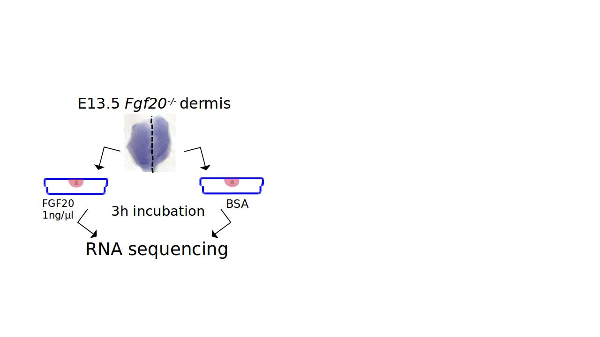

# Quality control

## Getting your share of the data 

The data used in this RNA-seq practice session are taken from published artcile (Biggs et. al. 2018). In this study, E13.5 mouse dermis (skin) was cut into two halves along the midline and one half was incubated in recombinant FGF20 protein and the other with protein vehicle. The objective was to identify up- and down-regulated genes through RNA-sequencing to reveal FGF20 signalling target genes. The cDNA libraries were prepared with TruSeq *Stranded* Total RNA kit with RiboZero (Illumina, San Diego, CA) ribosomal RNA eliminator kit, and single ends of samples were sequenced with NextSeq500 (Illumina, San Diego, CA).


Open putty and login to server. Run following commands one by one.  

#### First we will copy the fastq files generated by the sequencing unit.

```{bash eval=FALSE}
cd $WRKDIR
cd DONOTREMOVE
mkdir day7
cd day7

# copy raw fastq files
cp /wrk/dasroy/DONOTREMOVE/GMB-203_rnaSeq/RNAseq_exercise.tar.gz ./
## Extract the data
tar -xvf RNAseq_exercise.tar.gz

cd RNAseq_exercise/
ls -lrth rawReads/*
# [Remember: FASTQ  or FQ file formats are same]
```


## Workflow 

- Day 7
1. Quality Assessment (QA) of raw reads using FastQC  
2. rRNA filtering using SortMeRna  
    * QA of filtered reads using MultiQC
3. Quality trimming and adapter removal using Trimmomatic
    * QA using FastQC
- Day 8
4. Trimmed reads alignment using STAR
    * QA with MultiQC
5. Read count summarization using HTSeq htseq-count
    * QA with MultiQC

Step 2 and 3 can be done in any order.

## Step 1. QA of raw reads

The first pre-processing step is to assess the quality of the raw data received from the sequencing facility. This data is commonly delivered in FASTQ format ( file extension fastq or fq).

Upon receiving the RNA-Seq FASTQ files from the sequencing facility, it is essential that some initial QC assessments be performed. Most importantly, one should check the overall sequence quality, the GC percentage distribution ( the proportion of guanine and cytosine bp across the reads) and the presence / absence of overrepresented sequences. FastQC has become a de-facto standard for performing this task http://www.bioinformatics.babraham.ac.uk/projects/fastqc/. A FastQC command line example is as follows:


```{bash eval=FALSE}

# First, make an output directory called "qa" (to collect all quality assessment reports) and a sub-directory of that called "rawReads"
mkdir -p qa/rawReads_fastqc

# First we load biokit module to access FastQC.
module load biokit
fastqc --help

# Sample command to execute on a single file
fastqc -o qa/rawReads_fastqc rawReads/Derm5Ctrl_run032119.fastq.gz 

# What are the output files. 
ls -lrth qa/rawReads/
```

The output of FastQC is a zip archive and an HTML document, which is sub-divided into sections describing the specific metrics that were analyzed. **Login to sui.csc.fi** and view any single report and go through the following categories. 


### FastQC on rest of the fastq files

There are so many fastq files to process. However FastQC can run a number of files in parallel (see the -t option).

* fastqc -o qa/raw -t 16 raw/*.fastq.gz 

But let us run through by submitting as SLURM job. 
[ SLURM is a popular job scheduling system, another [example](https://hbctraining.github.io/Intro-to-rnaseq-hpc-O2/lessons/02_assessing_quality.html) ]

Copy following text to a file __fastqc_parallel.sh__  with *nano* editor.


    #!/bin/bash -l
    #SBATCH -J fastqc
    #SBATCH --constraint="snb|hsw"
    #SBATCH -o fastqc_out_%j.txt
    #SBATCH -e fastqc_err_%j.txt
    #SBATCH -p serial
    #SBATCH -n 1
    #SBATCH --cpus-per-task=6 ## *Number of fastq files*
    #SBATCH -t 00:50:00
    #SBATCH --mem-per-cpu=2000
    #SBATCH --mail-type=END
    
    module load biokit
    
    ## mkdir -p qa/rawReads
    fastqc -o qa/rawReads_fastqc -t $SLURM_CPUS_PER_TASK rawReads/*.fastq.gz


Submit this job with following command

> sbatch  fastqc_parallel.sh ## \--mail-user your@email.com [using email is optional]

Check status of job

> watch \"squeue -u $USER\"

To exit "Watch" press

> Ctrl+C 


The metrics are explained in the slides.

_Check the out and error files_ fastqc_out_\*.txt and fastqc_err_\*.txt . These are the files which will contain any execution errors.


### Summerize 

Finally, also run [__multiqc__](https://multiqc.info/) to summarize all data in one file. First we need to install multiqc which is not available in taito.csc.fi . Executes the following commands only once

```{bash install_multiqc,eval=FALSE}
# Execute this command only once in your account
module load biopython-env
pip install --upgrade pip
pip install multiqc
pip install numpy --upgrade

## Check the installation and manual
multiqc -h
```

  
Now summarize all fastqc reports from qa/rawReads directory to a single html file.

```{bash eval=FALSE }
module load biopython-env
multiqc -o qa/ -n rawReads qa/rawReads_fastqc

# unload unnecessary module
module unload biopython-env
```

Now open the file qa/rawReads.html in the browser 

## Step 2. Filtering rRNA

Typically, wet-lab protocols to extract mRNA include a step to deplete the sample of rRNA or to enrich it for poly-adenylated transcripts (rRNA is not poly-adenylated). Common approaches to achieve this are to use commercial kits or poly-dT beads, respectively. No approach will be fully sensitive and, as a result, some rRNA carryover is to be expected. This is not a problem per se as long as the remaining proportion accounts for a low percentage of the reads (commonly between 0.1 and 3%). Larger proportions will have an effect on the usable number of reads obtained from the samples, as fewer sequence reads would originate from expressed mRNAs. This is not to be overlooked as these rRNAs will produce valid alignments (in all reference genomes and for most de novo assembled transcriptomes and genomes) and hence other metrics (such as the alignment rate) will fail to identify such a bias. To control for the rRNA quantity in our sample FastQ files, we use [SortMeRna](https://bioinfo.lifl.fr/RNA/sortmerna/), a tool originally developed to identify rRNA in metagenomics analyses (Kopylova, Noé, and Touzet 2012). The tool accepts FASTQ files (SE (single ended) or PE (paired ended)) as input and includes a set of *reference libraries* containing the most common rRNAs (5,5.8,16, 18, 23 and 26-28S). One of the sources of rRNA sequnces in fasta format is available [here](https://github.com/biocore/sortmerna/tree/master/rRNA_databases). 

```{bash eval=FALSE }
# Store rRna filtered reads in "sortMeRna" directory
mkdir sortMeRna 

module load qiime/1.9.1
sortmerna -h
```


At first it is important to index once the reference libraries ( provided in fasta format) with following command. **BUT do not execute** it now as it is a time and memory consuming process.

```{bash index_sort,eval=FALSE}
## Example command to index reference library
indexdb_rna --ref path_to_reference_file.fasta,path_to_indexed_file.idx

## Example command to filter out rRNA reads
sortmerna  --ref  path_to_reference_file.fasta,path_to_indexed_file.idx  \
 --reads input.fastq  \
 --aligned rRNA_reads.fastq \
 --other non_rRna_reads.fastq \
 --sam --SQ --log -v  --fastx  -a 4 # Number of cpus
```

Later you can try to index it yourself. 

Here we will use pre-indexed *reference libraries* (combined in a single fasta file all_rfam_arc_bac_5_16_18_23_28s.fasta ).  

Copy following text to a file __sortmerna_script.sh__  with *nano* editor.


    #!/bin/bash -l
    #SBATCH -J sortmerna
    #SBATCH --constraint="snb|hsw"
    #SBATCH -o sortmerna_out_%j.txt
    #SBATCH -e sortmerna_err_%j.txt
    #SBATCH -p serial
    #SBATCH -n 1
    #SBATCH --cpus-per-task=4 
    #SBATCH -t 01:00:00
    #SBATCH --mem-per-cpu=2000
    #SBATCH --mail-type=END
    
    # First uncompress  reads:
    zcat rawReads/Derm5Ctrl_run032119.fastq.gz > rawReads/Derm5Ctrl_run032119.fastq
    
    module load qiime/1.9.1
    # Run sortmerna
    sortmerna  --ref  /wrk/dasroy/DONOTREMOVE/GMB-203_rnaSeq/sortmerna_rRNA_database/all_rfam_arc_bac_5_16_18_23_28s.fasta,/wrk/dasroy/DONOTREMOVE/GMB-203_rnaSeq/sortmerna_rRNA_database/all_rfam_arc_bac_5_16_18_23_28s.idx \
    --reads rawReads/Derm5Ctrl_run032119.fastq  \
    --aligned sortMeRna/rRna_Derm5Ctrl_run032119 \
    --other sortMeRna/non_rRna_Derm5Ctrl_run032119 \
    --sam --SQ --log -v  --fastx  -a $SLURM_CPUS_PER_TASK 
    
    
    # Compress the files
    gzip sortMeRna/non_rRna_Derm5Ctrl_run032119.fastq


The batch job could be launched with command:

> sbatch sortmerna_script.sh


The quantity of found rRNAs are given in the last line of log files

```{bash finishing_sortmerna,eval=FALSE}
# What are the out put files
ls -lrth sortMeRna

# reads/sam files correspond to rRna  could be deleted, we only need them for when there are high % of rRNA
rm sortMeRna/rRna_Derm5Ctrl_run032119.fastq sortMeRna/rRna_Derm5Ctrl_run032119.sam

# What is the %rRNA in one of the sample files?
less sortMeRna/rRna_Derm5Ctrl_run032119.log

# unload unnecessary module
module unload qiime/1.9.1
```


The above script should be used for each fastq file individually by editing every time. However to save time we will copy the rest of the files.


```{bash eval=FALSE }
cp /wrk/dasroy/DONOTREMOVE/GMB-203_rnaSeq/sortMeRna/* sortMeRna/

# These log files should also exist in qa directory, hence make a shortut link of "sortMeRna" there 

ln -s $WRKDIR/DONOTREMOVE/day7/RNAseq_exercise/sortMeRna/ qa/sortMeRna


# Summarize the result with after processing all the fastq files with sortmerna
module load biopython-env
multiqc -o qa/ -n sortMeRna qa/sortMeRna

module unload biopython-env
```


## Step 3. Quality trimming and adapter removal

It is a fact that on Illumina sequencers, the quality of a base pair is linked to its position in the read, bases in the later cycles of the sequencing process have a lower average quality than the earliest cycles (as was observed in the QC report above). This effect depends on the sequencing facility and on the chemistry used and it is only recently that sequencing aligners have integrated methods to correct for this - and not all alignment software does so. A common approach to increase the mapping rate of reads is to *trim (remove) low quality bases* from the 3’ end until the quality reaches a user-selected Phred-quality threshold. A threshold of 20 is widely accepted as it corresponds to a base call error of 1 in a 100, which is approximately the inherent technical error rate of the Illumina sequencing platform.

An additional issue encountered with Illumina sequencing is the *presence of partial adapter sequences* within sequenced reads. This arises when the sample fragment size has a large variance and fragments shorter than the sequencer read-length are sequenced. As the resulting reads may contain a significant part of the adapter - a bp sequence of artificial origin - earlier generation alignment software ( those that do not use Maximum Exact Matching and require global alignment of an entire read) may not be able to map such reads. Being able to identify the adapter-like sequences at the end of the read and clip/trim them - a process termed adapter removal - may consequently significantly increase the aligned read proportion.

There are numerous tools available to perform either or both of these tasks (quality trimming and adapter removal). Here, we exemplify using Trimmomatic (Bolger, Lohse, and Usadel 2014), a tool that does both. 

The selection of trimming steps and their associated parameters are supplied on the trimmomatic command line.

The current trimming steps are:

* ILLUMINACLIP: Cut adapter and other illumina-specific sequences from the read.
* SLIDINGWINDOW: Perform a sliding window trimming, cutting once the average quality within the window falls below a threshold.
* LEADING: Cut bases off the start of a read, if below a threshold quality
* TRAILING: Cut bases off the end of a read, if below a threshold quality
* CROP: Cut the read to a specified length
* HEADCROP: Cut the specified number of bases from the start of the read
* MINLEN: Drop the read if it is below a specified length
* TOPHRED33: Convert quality scores to Phred-33
* TOPHRED64: Convert quality scores to Phred-64

<font size="3" color="blue"> !!!WARNING!!! </font> Note that by default Trimmomatic tries to use all the computing cores of the server where it is launched. In Taito this approach is not feasible and *you should always use command line option -threads to limit the number of cores to be used*. Note that the -threads option should be given immediately after the mode selection (SE or PE).

A sample trimmomatic command for taito-shell ( character: "\\" indicates that the command line continues to the next row) :

```{bash sample_trimmo,eval=FALSE}
# Not to execute
trimmomatic SE -threads 4 -phred33 input.fq.gz output.fq.gz \
ILLUMINACLIP:/appl/bio/trimmomatic/adapters/TruSeq3-SE.fa:2:30:1 \
LEADING:3 TRAILING:3 SLIDINGWINDOW:4:15 MINLEN:36
```

This will perform the following:

* Remove adapters (ILLUMINACLIP:TruSeq3-PE.fa:2:30:1)
* Remove leading low quality or N bases (below quality 3) (LEADING:3)
* Remove trailing low quality or N bases (below quality 3) (TRAILING:3)
* Scan the read with a 4-base wide sliding window, cutting when the average quality per base drops below 15 (SLIDINGWINDOW:4:15)
* Drop reads below the 36 bases long (MINLEN:36)

```{bash eval=FALSE }
# make directory for trimmomatic outputs
mkdir -p trimmomatic
```

Here in the class we will use slurm scripts to use trimmomatic , also check taito [documentation](https://research.csc.fi/-/trimmomatic). Copy below lines to a file *trimmomatic_script.sh* with nano editor.

This script will perform as a batch job reserving 4 cores, 12 hours and 4 GB of memory:

    #!/bin/bash
    #SBATCH -J trimmomatic
    #SBATCH -N 1
    #SBATCH -p serial
    #SBATCH -t 01:00:00
    #SBATCH --mem=4000
    #SBATCH -o trimmomatic_out_%j.txt
    #SBATCH -e trimmomatic_err_%j.txt
    #SBATCH --cpus-per-task=8
    
    trimmomatic SE -phred33 -threads $SLURM_CPUS_PER_TASK  \
    sortMeRna/non_rRna_Derm5Ctrl_run032119.fastq.gz \
    trimmomatic/trimmed_non_rRna_Derm5Ctrl_run032119.fastq.gz \
    ILLUMINACLIP:/appl/bio/trimmomatic/adapters/TruSeq3-SE.fa:2:30:1 \
    LEADING:35


The batch job could be launched with command:

> sbatch trimmomatic_script.sh


Now we can copy the rest of the files and run MultiQC.  

```{bash eval=FALSE }
cp /wrk/dasroy/DONOTREMOVE/GMB-203_rnaSeq/trimmed_reads/* trimmomatic/
```

### Trimmed data FastQC

A final FastQC run is performed to ensure that the previous rRNA filtering, quality trimming and/or adapter removal steps successfully conserved high quality reads without being too stringent and without introducing any newly apparent technical biases.

Redo the FastQC on the Trimmomatic files you have generated.

```{bash eval=FALSE }
mkdir -p qa/trimmomatic_fastqc

## Make another slurm script similar to fastqc_parallel.sh by replacing "rawReads" with "trimmomatic"
sed 's/rawReads/trimmomatic/g' fastqc_parallel.sh > trimo_fastqc_parallel.sh

## inspect the difference
diff fastqc_parallel.sh trimo_fastqc_parallel.sh
```

Now execute it

> sbatch trimo_fastqc_parallel.sh

Check status of job

> watch “squeue -u $USER”

### Final filtering report


```{bash eval=FALSE }
module load biopython-env
multiqc -o qa/ -n trimmomatic qa/trimmomatic_fastqc

# unload unnecessary module
module unload biopython-env
```

